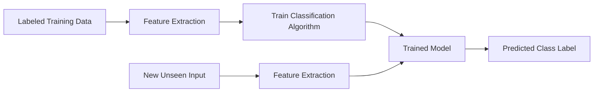

# 🏷️ Classification with Scikit-Learn

> **Topic:** Supervised Learning — Classification | **Library:** Scikit-Learn | **Language:** Python
> **Generated:** September 26, 2026

---

## 📑 Table of Contents

- [🏷️ What Is Classification?](#️-what-is-classification)
- [🧩 How Classification Works](#-how-classification-works)
- [🌳 Common Classification Algorithms](#-common-classification-algorithms)
  - [📈 Logistic Regression](#-logistic-regression)
  - [🌲 Decision Trees](#-decision-trees)
  - [🌳🌳 Random Forest](#-random-forest)
  - [🎲 Naive Bayes](#-naive-bayes)
  - [➗ Support Vector Machines (SVMs)](#-support-vector-machines-svms)
  - [📍 k-Nearest Neighbors](#-k-nearest-neighbors)
  - [🚀 Gradient Boosting](#-gradient-boosting)
  - [🔀 Linear & Quadratic Discriminant Analysis](#-linear--quadratic-discriminant-analysis)
  - [🧠 Multi-Layer Perceptron (Neural Network)](#-multi-layer-perceptron-neural-network)
  - [🥾 AdaBoost](#-adaboost)
  - [🌴 Extra Trees](#-extra-trees)
  - [⚡ Stochastic Gradient Descent Classifier](#-stochastic-gradient-descent-classifier)
- [🧾 Quick Reference Summary](#-quick-reference-summary)

---

## 🏷️ What Is Classification?

**Classification** is a method of **supervised learning** in which an algorithm is trained to assign one or more predefined labels to a given input. The goal is to learn a function that can accurately predict the class label of an unseen input, based on the labels of a set of labeled training data.

Classification algorithms typically take as input a set of **feature values** for a given observation and use those features to predict a discrete class label — as opposed to **regression**, which predicts a continuous numeric value.

> 💡 **Tip:** If your target variable is a category (`spam`/`not spam`, `cat`/`dog`/`bird`) you're solving a classification problem. If it's a continuous number (price, temperature), you want regression instead.

Common examples of classification problems include:

- **Image recognition** — identifying what object appears in a photo
- **Spam detection** — labeling an email as spam or not spam
- **Natural language processing** — tasks such as sentiment analysis or topic labeling

Classification problems also come in a few flavors:

| Type | Description | Example |
|---|---|---|
| **Binary** | Exactly two possible classes | Spam vs. not spam |
| **Multiclass** | More than two mutually exclusive classes | Classifying an image as cat, dog, or bird |
| **Multilabel** | An input can belong to more than one class at once | Tagging a news article with multiple topics |

---

## 🧩 How Classification Works

At a high level, every classifier follows the same supervised-learning workflow: learn patterns from labeled training data, then apply those patterns to predict labels for new, unseen data.



> 📝 **Note:** The quality of the predicted labels depends heavily on the quality and relevance of the input features — feature engineering is often as important as the choice of algorithm itself.

---

## 🌳 Common Classification Algorithms

Scikit-Learn implements a wide range of classification methods. Some of the most commonly used are described below, along with a minimal usage example for each.

### 📈 Logistic Regression

A **linear model** most often used for **binary classification**, where the goal is to predict one of two possible classes. Despite the name, logistic regression is a classification algorithm, not a regression one — it applies the logistic (sigmoid) function to a linear combination of the input features to output a probability between 0 and 1.

```python
from sklearn.linear_model import LogisticRegression

clf = LogisticRegression()
clf.fit(X_train, y_train)
predictions = clf.predict(X_test)
```

> 💡 **Tip:** Logistic regression works well as a fast, interpretable baseline model before trying more complex algorithms.

### 🌲 Decision Trees

A **tree-based model** that uses a series of if-then rules to make predictions. Starting at the root node, the tree repeatedly splits the data on the feature that best separates the classes, until it reaches a leaf node that outputs a predicted label.

```python
from sklearn.tree import DecisionTreeClassifier

clf = DecisionTreeClassifier(max_depth=5)
clf.fit(X_train, y_train)
predictions = clf.predict(X_test)
```

> ⚠️ **Warning:** Decision trees are prone to **overfitting** on training data, especially when grown to full depth. Limiting `max_depth` or pruning the tree helps control this.

### 🌳🌳 Random Forest

An **ensemble method** that combines many decision trees — each trained on a random subset of the data and features — to improve prediction accuracy and reduce overfitting compared to a single tree. The final prediction is typically the majority vote across all trees.

```python
from sklearn.ensemble import RandomForestClassifier

clf = RandomForestClassifier(n_estimators=100, random_state=42)
clf.fit(X_train, y_train)
predictions = clf.predict(X_test)
```

### 🎲 Naive Bayes

A **probabilistic model** that makes predictions based on the probability of each class given the input features, using Bayes' theorem. It is "naive" because it assumes all features are independent of one another given the class — an assumption that is often violated in practice but still yields strong results, especially for text classification.

```python
from sklearn.naive_bayes import GaussianNB

clf = GaussianNB()
clf.fit(X_train, y_train)
predictions = clf.predict(X_test)
```

> 💡 **Tip:** Naive Bayes is fast, requires relatively little training data, and is a popular choice for spam filtering and document classification.

### ➗ Support Vector Machines (SVMs)

A **linear model** (extendable to non-linear boundaries via the kernel trick) that finds the best boundary between classes by **maximizing the margin** — the distance between the boundary and the closest data points of each class, called support vectors.

```python
from sklearn.svm import SVC

clf = SVC(kernel="rbf", C=1.0)
clf.fit(X_train, y_train)
predictions = clf.predict(X_test)
```

### 📍 k-Nearest Neighbors

A simple, **instance-based** method that uses the `k` closest labeled examples to the input in question to make a prediction — typically by majority vote among those neighbors. It requires no explicit training phase, but predictions can be slow on large datasets since distances must be computed at query time.

```python
from sklearn.neighbors import KNeighborsClassifier

clf = KNeighborsClassifier(n_neighbors=5)
clf.fit(X_train, y_train)
predictions = clf.predict(X_test)
```

> ⚠️ **Warning:** k-NN is sensitive to feature scale — always scale/normalize features before fitting, or distances will be dominated by features with larger numeric ranges.

### 🚀 Gradient Boosting

An **ensemble method** that combines many weak models — typically shallow decision trees — built sequentially, where each new model corrects the errors of the previous ones. This often produces highly accurate models and underpins popular libraries such as XGBoost, LightGBM, and CatBoost.

```python
from sklearn.ensemble import GradientBoostingClassifier

clf = GradientBoostingClassifier(n_estimators=100, learning_rate=0.1)
clf.fit(X_train, y_train)
predictions = clf.predict(X_test)
```

### 🔀 Linear & Quadratic Discriminant Analysis

Models each class as a Gaussian distribution over the features and classifies a new input by comparing how likely it is under each class's distribution. **LDA** assumes all classes share a single covariance matrix, producing linear decision boundaries. **QDA** lets each class have its own covariance matrix, producing curved (quadratic) boundaries at the cost of more parameters to estimate.

```python
from sklearn.discriminant_analysis import LinearDiscriminantAnalysis, QuadraticDiscriminantAnalysis

lda = LinearDiscriminantAnalysis()
lda.fit(X_train, y_train)

qda = QuadraticDiscriminantAnalysis()
qda.fit(X_train, y_train)
```

> 💡 **Tip:** LDA also doubles as a dimensionality-reduction technique, projecting features onto the axes that best separate the classes.

### 🧠 Multi-Layer Perceptron (Neural Network)

A basic **feedforward neural network** classifier, consisting of one or more hidden layers of interconnected nodes with non-linear activation functions. It can capture more complex, non-linear relationships than linear models, at the cost of needing more data and careful tuning to avoid overfitting.

```python
from sklearn.neural_network import MLPClassifier

clf = MLPClassifier(hidden_layer_sizes=(100,), max_iter=500)
clf.fit(X_train, y_train)
predictions = clf.predict(X_test)
```

> ⚠️ **Warning:** Always scale input features before training an MLP — unscaled features can prevent the network from converging.

### 🥾 AdaBoost

An earlier **boosting** method than gradient boosting. It trains a sequence of weak learners (typically shallow decision trees), increasing the weight of misclassified samples after each round so subsequent learners focus on the harder cases. The final prediction is a weighted vote across all learners.

```python
from sklearn.ensemble import AdaBoostClassifier

clf = AdaBoostClassifier(n_estimators=100, random_state=42)
clf.fit(X_train, y_train)
predictions = clf.predict(X_test)
```

### 🌴 Extra Trees

Short for **Extremely Randomized Trees** — an ensemble method similar to Random Forest, but split thresholds are chosen randomly rather than searched for optimally at each node. This added randomness often reduces variance further and trains faster, typically with comparable accuracy to Random Forest.

```python
from sklearn.ensemble import ExtraTreesClassifier

clf = ExtraTreesClassifier(n_estimators=100, random_state=42)
clf.fit(X_train, y_train)
predictions = clf.predict(X_test)
```

### ⚡ Stochastic Gradient Descent Classifier

A linear classifier trained via **stochastic gradient descent**, capable of mimicking logistic regression, a linear SVM, or other linear loss functions depending on the `loss` parameter. Its incremental, one-sample-at-a-time updates make it well-suited to very large or streaming datasets that don't fit in memory.

```python
from sklearn.linear_model import SGDClassifier

clf = SGDClassifier(loss="log_loss", max_iter=1000)
clf.fit(X_train, y_train)
predictions = clf.predict(X_test)
```

---

## 🧾 Quick Reference Summary

| Algorithm | Code |
|---|---|
| Logistic Regression | `from sklearn.linear_model import LogisticRegression` |
| Decision Trees | `from sklearn.tree import DecisionTreeClassifier` |
| Random Forest | `from sklearn.ensemble import RandomForestClassifier` |
| Naive Bayes | `from sklearn.naive_bayes import GaussianNB` |
| Support Vector Machines | `from sklearn.svm import SVC` |
| k-Nearest Neighbors | `from sklearn.neighbors import KNeighborsClassifier` |
| Gradient Boosting | `from sklearn.ensemble import GradientBoostingClassifier` |
| Linear/Quadratic Discriminant Analysis | `from sklearn.discriminant_analysis import LinearDiscriminantAnalysis, QuadraticDiscriminantAnalysis` |
| Multi-Layer Perceptron | `from sklearn.neural_network import MLPClassifier` |
| AdaBoost | `from sklearn.ensemble import AdaBoostClassifier` |
| Extra Trees | `from sklearn.ensemble import ExtraTreesClassifier` |
| SGD Classifier | `from sklearn.linear_model import SGDClassifier` |
