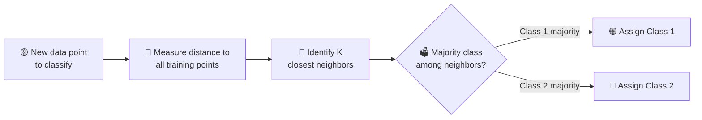
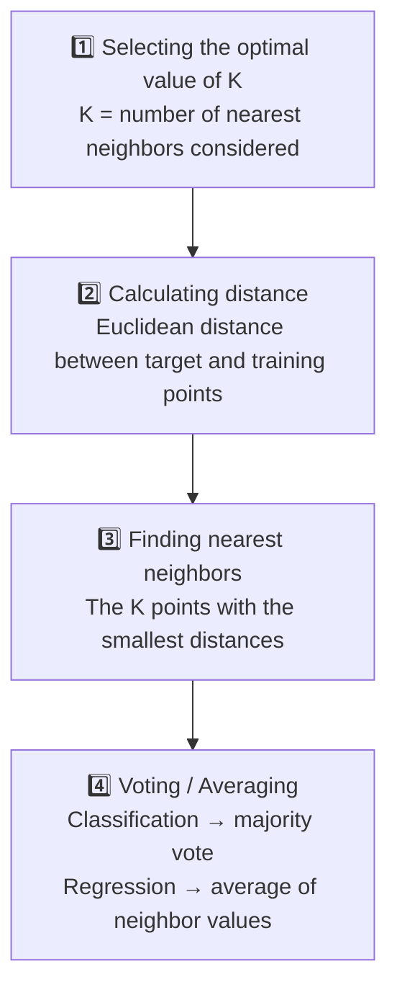

# 🔍 K-Nearest Neighbor (KNN) Algorithm

> **Source:** GeeksforGeeks | **Article Last Updated:** 2 May, 2026 | **Original URL:** [geeksforgeeks.org/machine-learning/k-nearest-neighbours](https://www.geeksforgeeks.org/machine-learning/k-nearest-neighbours/)
> **Markdown Generated:** 26 September, 2026

---

## 📑 Table of Contents

- [📘 Overview](#-overview)
- [🔢 Understanding "K" in K-Nearest Neighbour](#-understanding-k-in-k-nearest-neighbour)
- [🎚️ How to Choose the Value of K for KNN Algorithm?](#️-how-to-choose-the-value-of-k-for-knn-algorithm)
  - [📊 Statistical Methods for Selecting K](#-statistical-methods-for-selecting-k)
- [📏 Distance Metrics Used in KNN Algorithm](#-distance-metrics-used-in-knn-algorithm)
  - [1️⃣ Euclidean Distance](#1️⃣-euclidean-distance)
  - [2️⃣ Manhattan Distance](#2️⃣-manhattan-distance)
  - [3️⃣ Minkowski Distance](#3️⃣-minkowski-distance)
- [⚙️ Working of KNN Algorithm](#️-working-of-knn-algorithm)
- [🐍 Implementing KNN from Scratch in Python](#-implementing-knn-from-scratch-in-python)
- [🚀 Applications](#-applications)
- [✅ Advantages](#-advantages)
- [⚠️ Disadvantages](#️-disadvantages)
- [🔗 Related Articles](#-related-articles)
- [🧾 Quick Reference Summary](#-quick-reference-summary)

---

## 📘 Overview

**K-Nearest Neighbor (KNN)** is a simple and widely used machine learning technique for classification and regression tasks. It works by identifying the **K** closest data points to a given input and making predictions based on the majority class or average value of those neighbors.

- Classifies data based on similarity with nearby data points
- Uses distance metrics like Euclidean distance to find nearest neighbors
- Since KNN makes no assumptions about the underlying data distribution, it is a **non-parametric** and **instance-based** learning method

> 📝 **Note:** KNN is also called a **lazy learner** algorithm because it does not learn from the training set immediately — instead it stores the entire dataset and performs computations only at the time of classification.

**Example — two features, Category 1 and Category 2:**

- KNN assigns the category based on the majority of nearby points
- The green points represent Category 1 and the red points represent Category 2
- The new data point checks its closest neighbors (circled points)
- Since the majority of its closest neighbors are red points (Category 2), KNN predicts the new data point belongs to Category 2



KNN works by using **proximity** and **majority voting** to make predictions.

---

## 🔢 Understanding "K" in K-Nearest Neighbour

In the KNN algorithm, `k` is just a number that tells the algorithm how many nearby points, or neighbors, to look at when it makes a decision.

> 💡 **Example:** Imagine you're deciding what fruit it is based on its shape and size. You compare it to fruits you already know.
>
> - If `k = 3`, the algorithm looks at the 3 closest fruits to the new one
> - If 2 of those 3 fruits are apples and 1 is a banana, the algorithm says the new fruit is an apple, because most of its neighbors are apples

---

## 🎚️ How to Choose the Value of K for KNN Algorithm?

The value of `k` in KNN decides how many neighbors the algorithm looks at when making a prediction. Choosing the right `k` is important for good results.

- If the data has lots of noise or outliers, using a larger `k` can make the predictions more stable
- But if `k` is too large, the model may become too simple and miss important patterns — this is called **underfitting**
- So `k` should be picked carefully based on the data

### 📊 Statistical Methods for Selecting K

| Method | Description |
|---|---|
| **Cross-Validation** | Divide the dataset into `k` parts (folds). Train the model on some of these parts and test on the remaining ones, repeating for each part, to find the best value of `k` |
| **Elbow Method** | Plot the error rate or accuracy for different `k` values. Error usually drops quickly at first, then levels off. The "elbow" point where the curve bends is usually the best choice for `k` |
| **Odd Values for k** | Use an odd number for `k`, especially in classification problems, to avoid ties when deciding which class is most common among the neighbors |

---

## 📏 Distance Metrics Used in KNN Algorithm

KNN uses distance metrics to identify the nearest neighbors, which are then used for classification and regression tasks.

### 1️⃣ Euclidean Distance

Euclidean distance is the straight-line distance between two points in a plane or space — the shortest path you would walk if you went directly from one point to another.

$$d(x, X_i) = \sqrt{\sum_{j=1}^{n} (x_j - X_{ij})^2}$$

### 2️⃣ Manhattan Distance

This is the total distance you would travel if you could only move along horizontal and vertical lines, like a grid or city streets. It's also called **"taxicab distance"** because a taxi can only drive along the grid-like streets of a city.

$$d(x, y) = \sum_{i=1}^{n} |x_i - y_i|$$

### 3️⃣ Minkowski Distance

Minkowski distance is like a family of distances, which includes both Euclidean and Manhattan distances as special cases.

$$d(x, y) = \left( \sum_{i=1}^{n} (x_i - y_i)^p \right)^{\frac{1}{p}}$$

> 💡 **Tip:** From the formula above, when `p = 2` it becomes the Euclidean distance formula, and when `p = 1` it turns into the Manhattan distance formula. Minkowski distance is essentially a flexible formula that can represent either, depending on the value of `p`.

---

## ⚙️ Working of KNN Algorithm

The KNN algorithm operates on the principle of similarity, where it predicts the label or value of a new data point by considering the labels or values of its K nearest neighbors in the training dataset.



**Step 1 — Selecting the optimal value of K**
- K is the number of nearest neighbors considered for prediction

**Step 2 — Calculating distance**
- To measure the similarity between the target and training data points, Euclidean distance is widely used. Distance is calculated between each data point in the dataset and the target point

**Step 3 — Finding nearest neighbors**
- The `k` data points with the smallest distances to the target point are the nearest neighbors

**Step 4 — Voting for classification or taking the average for regression**
- **Classification:** to classify a data point into a category like spam or not spam, KNN looks at the K closest points, then picks the category that appears most among them — this is called **majority voting**
- **Regression:** instead of voting for a class, KNN takes the average of the values of the K nearest neighbors as the predicted value for the new point

> 📝 **Note:** As a test point moves, the algorithm re-identifies the closest `k` data points (5, in the source example) and assigns the test point the majority class label among them.

---

## 🐍 Implementing KNN from Scratch in Python

### 📦 1. Importing Libraries

`Counter` is used to count the occurrences of elements in a list or iterable. After finding the k nearest neighbor labels, `Counter` helps count how many times each label appears.

```python
import numpy as np
from collections import Counter
```

### 📐 2. Defining the Euclidean Distance Function

`euclidean_distance` calculates the Euclidean distance between two points.

```python
def euclidean_distance(point1, point2):
    return np.sqrt(np.sum((np.array(point1) - np.array(point2))**2))
```

### 🎯 3. KNN Prediction Function

- `distances.append` saves how far each training point is from the test point, along with its label
- `distances.sort` sorts the list so the nearest points come first
- `k_nearest_labels` picks the labels of the k closest points
- `Counter` finds which label appears most among those k labels — that becomes the prediction

```python
def knn_predict(training_data, training_labels, test_point, k):
    distances = []
    for i in range(len(training_data)):
        dist = euclidean_distance(test_point, training_data[i])
        distances.append((dist, training_labels[i]))

    distances.sort(key=lambda x: x[0])
    k_nearest_labels = [label for _, label in distances[:k]]

    return Counter(k_nearest_labels).most_common(1)[0][0]
```

### 🗂️ 4. Training Data, Labels, and Test Point

```python
training_data = [[1, 2], [2, 3], [3, 4], [6, 7], [7, 8]]
training_labels = ['A', 'A', 'A', 'B', 'B']
test_point = [4, 5]
k = 3
```

### ▶️ 5. Prediction

```python
prediction = knn_predict(training_data, training_labels, test_point, k)
print(prediction)
```

**Output:**

```text
A
```

> 💡 **Tip:** The algorithm calculates the distances of the test point `[4, 5]` to all training points, selects the 3 closest points (since `k = 3`), and determines their labels. Since the majority of the closest points are labelled `'A'`, the test point is classified as `'A'`.

> 📝 **Note:** In practice, the Scikit-learn Python library provides built-in functions to perform KNN — see the *Implementation of KNN classifier using Sklearn* article for the library-based approach.

---

## 🚀 Applications

| Application | How KNN Is Used |
|---|---|
| **Recommendation Systems** | Suggests items like movies or products by finding users with similar preferences |
| **Spam Detection** | Identifies spam emails by comparing new emails to known spam and non-spam examples |
| **Customer Segmentation** | Groups customers by comparing their shopping behavior to others |
| **Speech Recognition** | Matches spoken words to known patterns to convert them into text |

---

## ✅ Advantages

- **Simple to use:** Easy to understand and implement
- **No training step:** No need to train, as it just stores the data and uses it during prediction
- **Few parameters:** Only needs to set the number of neighbors (`k`) and a distance method
- **Versatile:** Works for both classification and regression problems

---

## ⚠️ Disadvantages

> ⚠️ **Warning:** KNN's simplicity comes with real trade-offs at scale and in high dimensions — worth weighing before choosing it for large or wide datasets.

- **Slow with large data:** Needs to compare every point during prediction
- **Struggles with many features:** Accuracy drops when data has too many features
- **Can overfit:** KNN can overfit when `k` is very small or when the data contains noise
- **Curse of dimensionality:** In high-dimensional data, distance metrics become less meaningful, which reduces the effectiveness of KNN

---

## 🔗 Related Articles

- [K Nearest Neighbors with Python | ML](https://www.geeksforgeeks.org/machine-learning/k-nearest-neighbours/)
- [Implementation of K-Nearest Neighbors from Scratch using Python](https://www.geeksforgeeks.org/machine-learning/k-nearest-neighbours/)
- [Mathematical explanation of K-Nearest Neighbour](https://www.geeksforgeeks.org/machine-learning/k-nearest-neighbours/)
- [Weighted K-NN](https://www.geeksforgeeks.org/machine-learning/k-nearest-neighbours/)

> 📝 **Note:** The source article links these related titles without distinct destination URLs — all point back to the same KNN article page. Search GeeksforGeeks directly by title for the standalone articles.

---

## 🧾 Quick Reference Summary

| Task | Code |
|---|---|
| Compute Euclidean distance between two points | `np.sqrt(np.sum((np.array(p1) - np.array(p2))**2))` |
| Store distance + label pairs | `distances.append((dist, label))` |
| Sort by nearest first | `distances.sort(key=lambda x: x[0])` |
| Take the k nearest labels | `[label for _, label in distances[:k]]` |
| Majority vote among neighbor labels | `Counter(k_nearest_labels).most_common(1)[0][0]` |
| Minkowski distance (general form, `p`) | $d(x,y) = \left(\sum_{i=1}^{n}\lvert x_i-y_i\rvert^p\right)^{1/p}$ |
