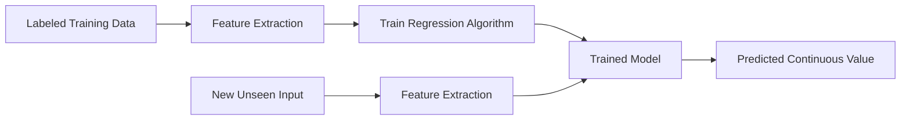

# 📈 Regression with Scikit-Learn

> **Topic:** Supervised Learning — Regression | **Library:** Scikit-Learn | **Language:** Python
> **Generated:** September 26, 2026

---

## 📑 Table of Contents

- [📈 What Is Regression?](#-what-is-regression)
- [🧩 How Regression Works](#-how-regression-works)
- [🌳 Common Regression Algorithms](#-common-regression-algorithms)
  - [📏 Linear Regression](#-linear-regression)
  - [🌀 Polynomial Regression](#-polynomial-regression)
  - [🏔️ Ridge Regression](#️-ridge-regression)
  - [🎯 Lasso Regression](#-lasso-regression)
  - [🌲 Decision Tree Regression](#-decision-tree-regression)
  - [🌳🌳 Random Forest Regression](#-random-forest-regression)
  - [🚀 Gradient Boosting Regression](#-gradient-boosting-regression)
  - [➗ Support Vector Regression (SVR)](#-support-vector-regression-svr)
  - [📍 k-Nearest Neighbors Regression](#-k-nearest-neighbors-regression)
  - [⚖️ Elastic Net Regression](#️-elastic-net-regression)
- [🧾 Quick Reference Summary](#-quick-reference-summary)

---

## 📈 What Is Regression?

**Regression** is a **supervised learning** task in which an algorithm learns to predict a **continuous output value** (or target) based on input features. The goal is to find the model that most accurately predicts the target value for new, unseen inputs.

> 💡 **Tip:** If your target variable is a number that can take a range of values (price, temperature, age) you want regression. If it's a category, you want [classification](#) instead.

Where classification assigns a discrete label, regression estimates a numeric quantity — examples include predicting house prices, forecasting demand, or estimating a patient's length of stay.

---

## 🧩 How Regression Works

Like classification, every regressor follows the standard supervised-learning workflow — but instead of predicting a class label, the model outputs a continuous number.



> 📝 **Note:** Regression models are typically evaluated with error-based metrics — Mean Squared Error (MSE), Root Mean Squared Error (RMSE), Mean Absolute Error (MAE), or R² — rather than accuracy, since predictions are numeric rather than categorical.

---

## 🌳 Common Regression Algorithms

Scikit-Learn implements a wide range of regression methods. Some of the most commonly used are described below, along with a minimal usage example for each.

### 📏 Linear Regression

A simple model that finds the **best linear relationship** between the input features and the target value, by fitting a straight line (or hyperplane, with multiple features) that minimizes the squared error between predicted and actual values.

```python
from sklearn.linear_model import LinearRegression

reg = LinearRegression()
reg.fit(X_train, y_train)
predictions = reg.predict(X_test)
```

> 💡 **Tip:** Linear regression is a fast, interpretable baseline — its coefficients directly show each feature's effect on the target.

### 🌀 Polynomial Regression

A **non-linear extension** of linear regression that transforms the input features into polynomial terms (e.g. x², x³) before fitting a linear model. This lets a linear model capture curved relationships between features and the target.

```python
from sklearn.preprocessing import PolynomialFeatures
from sklearn.linear_model import LinearRegression
from sklearn.pipeline import make_pipeline

reg = make_pipeline(PolynomialFeatures(degree=3), LinearRegression())
reg.fit(X_train, y_train)
predictions = reg.predict(X_test)
```

> ⚠️ **Warning:** Higher polynomial degrees fit the training data more closely but are prone to **overfitting** — validate on held-out data before increasing the degree.

### 🏔️ Ridge Regression

A linear regression model that adds an **L2 regularization** term, penalizing large coefficient values. This shrinks coefficients toward zero (without eliminating them) to reduce overfitting and improve generalization, especially when features are correlated.

```python
from sklearn.linear_model import Ridge

reg = Ridge(alpha=1.0)
reg.fit(X_train, y_train)
predictions = reg.predict(X_test)
```

### 🎯 Lasso Regression

A linear regression model that adds an **L1 regularization** term, which can shrink the coefficients of less important features all the way to **zero**. This makes Lasso useful for automatic feature selection alongside prediction.

```python
from sklearn.linear_model import Lasso

reg = Lasso(alpha=1.0)
reg.fit(X_train, y_train)
predictions = reg.predict(X_test)
```

> 💡 **Tip:** Use Lasso when you suspect many input features are irrelevant — it will effectively drop them from the model by zeroing their coefficients.

### 🌲 Decision Tree Regression

A **tree-based model** that uses a series of if-then rules to make predictions, splitting the data at each node on the feature and threshold that most reduces prediction error, until reaching a leaf that outputs a numeric value.

```python
from sklearn.tree import DecisionTreeRegressor

reg = DecisionTreeRegressor(max_depth=5)
reg.fit(X_train, y_train)
predictions = reg.predict(X_test)
```

> ⚠️ **Warning:** Like their classification counterparts, decision tree regressors overfit easily when grown to full depth — constrain `max_depth` or use an ensemble method instead.

### 🌳🌳 Random Forest Regression

An **ensemble method** that combines many decision trees — each trained on a random subset of the data and features — and averages their individual predictions to produce a more accurate, less variable estimate than any single tree.

```python
from sklearn.ensemble import RandomForestRegressor

reg = RandomForestRegressor(n_estimators=100, random_state=42)
reg.fit(X_train, y_train)
predictions = reg.predict(X_test)
```

### 🚀 Gradient Boosting Regression

An **ensemble method** that builds a sequence of weak models — typically shallow trees — where each new model is trained to correct the residual errors of the ones before it. This often achieves the highest accuracy of these methods on tabular data, and underpins libraries such as XGBoost, LightGBM, and CatBoost.

```python
from sklearn.ensemble import GradientBoostingRegressor

reg = GradientBoostingRegressor(n_estimators=100, learning_rate=0.1)
reg.fit(X_train, y_train)
predictions = reg.predict(X_test)
```

### ➗ Support Vector Regression (SVR)

The regression counterpart to the Support Vector Machine classifier. Instead of maximizing the margin between classes, SVR fits a function that keeps as many training points as possible within a margin of tolerance (`epsilon`) around the predicted line, only penalizing points that fall outside it. Non-linear relationships can be captured via the kernel trick (e.g. an RBF kernel).

```python
from sklearn.svm import SVR

reg = SVR(kernel="rbf", C=1.0, epsilon=0.1)
reg.fit(X_train, y_train)
predictions = reg.predict(X_test)
```

> ⚠️ **Warning:** SVR is sensitive to feature scale — scale/normalize inputs before fitting, and expect training to slow considerably on large datasets.

### 📍 k-Nearest Neighbors Regression

An **instance-based** method that predicts a target value by averaging the values of the `k` closest labeled examples to the input in question. Like its classification counterpart, it requires no explicit training phase, but predictions can be slow at query time on large datasets.

```python
from sklearn.neighbors import KNeighborsRegressor

reg = KNeighborsRegressor(n_neighbors=5)
reg.fit(X_train, y_train)
predictions = reg.predict(X_test)
```

> 💡 **Tip:** As with k-NN classification, always scale features first — unscaled features with large numeric ranges will dominate the distance calculation.

### ⚖️ Elastic Net Regression

A linear regression model that combines **both L1 (Lasso) and L2 (Ridge) regularization**, controlled by a mixing parameter (`l1_ratio`). This gives Elastic Net the feature-selection benefit of Lasso while retaining Ridge's stability when features are highly correlated.

```python
from sklearn.linear_model import ElasticNet

reg = ElasticNet(alpha=1.0, l1_ratio=0.5)
reg.fit(X_train, y_train)
predictions = reg.predict(X_test)
```

> 💡 **Tip:** Elastic Net is a good default when you're unsure whether Ridge or Lasso is the better fit — `l1_ratio` lets you tune between the two rather than committing to one.

---

## 🧾 Quick Reference Summary

| Algorithm | Code |
|---|---|
| Linear Regression | `from sklearn.linear_model import LinearRegression` |
| Polynomial Regression | `from sklearn.preprocessing import PolynomialFeatures` |
| Ridge Regression | `from sklearn.linear_model import Ridge` |
| Lasso Regression | `from sklearn.linear_model import Lasso` |
| Decision Tree Regression | `from sklearn.tree import DecisionTreeRegressor` |
| Random Forest Regression | `from sklearn.ensemble import RandomForestRegressor` |
| Gradient Boosting Regression | `from sklearn.ensemble import GradientBoostingRegressor` |
| Support Vector Regression | `from sklearn.svm import SVR` |
| k-Nearest Neighbors Regression | `from sklearn.neighbors import KNeighborsRegressor` |
| Elastic Net Regression | `from sklearn.linear_model import ElasticNet` |
