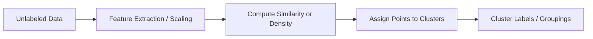

# 🧬 Clustering with Scikit-Learn

> **Topic:** Unsupervised Learning — Clustering | **Library:** Scikit-Learn | **Language:** Python
> **Generated:** September 26, 2026

---

## 📑 Table of Contents

- [🧬 What Is Clustering?](#-what-is-clustering)
- [🧩 How Clustering Works](#-how-clustering-works)
- [🌳 Common Clustering Algorithms](#-common-clustering-algorithms)
  - [🎯 k-Means](#-k-means)
  - [🌲 Hierarchical Clustering](#-hierarchical-clustering)
  - [🔍 DBSCAN](#-dbscan)
  - [🔔 Gaussian Mixture Model](#-gaussian-mixture-model)
  - [🧲 Mean Shift](#-mean-shift)
  - [🕸️ Spectral Clustering](#️-spectral-clustering)
  - [📨 Affinity Propagation](#-affinity-propagation)
  - [🧱 BIRCH](#-birch)
  - [🌀 OPTICS](#-optics)
- [🧾 Quick Reference Summary](#-quick-reference-summary)

---

## 🧬 What Is Clustering?

**Clustering** is an **unsupervised learning** task in which an algorithm groups a set of objects such that objects in the same group (a **cluster**) are more similar to each other than to those in other groups. Unlike classification, clustering has no predefined labels to learn from — the goal is to discover the inherent groupings or structure already present in the data.

> 💡 **Tip:** Reach for clustering when you don't have labeled data but want to find natural segments — customer segmentation, anomaly detection, or document grouping are classic use cases.

Because there's no ground-truth label to check predictions against, clustering quality is typically judged with metrics like the **silhouette score**, **Davies-Bouldin index**, or by domain-expert review of the resulting groups — rather than accuracy or error.

---

## 🧩 How Clustering Works

Clustering algorithms differ significantly in *how* they define a "group," but the general workflow — measure similarity between points, then partition or merge them accordingly — is shared across methods.



> ⚠️ **Warning:** Most clustering algorithms are sensitive to **feature scale** — always standardize or normalize features before clustering, or features with larger numeric ranges will dominate the distance calculations.

---

## 🌳 Common Clustering Algorithms

Scikit-Learn implements a wide range of clustering methods. Some of the most commonly used are described below, along with a minimal usage example for each.

### 🎯 k-Means

Partitions a dataset into **k clusters**, where each cluster is defined by the mean (**centroid**) of the points assigned to it. The algorithm iteratively assigns each point to its nearest centroid, then recomputes centroids from the new assignments, until the clusters stabilize.

```python
from sklearn.cluster import KMeans

model = KMeans(n_clusters=3, random_state=42)
labels = model.fit_predict(X)
```

> ⚠️ **Warning:** k-Means requires you to choose `k` in advance and assumes roughly spherical, similarly sized clusters — it performs poorly on irregularly shaped or unevenly sized groups. The **elbow method** or **silhouette score** are common ways to help choose `k`.

### 🌲 Hierarchical Clustering

Builds a **hierarchy of clusters** rather than a single flat partition, either by starting with each point as its own cluster and repeatedly merging the closest pairs (**agglomerative**, the more common approach) or by starting with one cluster and repeatedly splitting it (**divisive**). The result is often visualized as a **dendrogram**, and any number of clusters can be extracted by "cutting" the hierarchy at a chosen height.

```python
from sklearn.cluster import AgglomerativeClustering

model = AgglomerativeClustering(n_clusters=3, linkage="ward")
labels = model.fit_predict(X)
```

> 💡 **Tip:** Unlike k-Means, hierarchical clustering doesn't require committing to `k` upfront — the dendrogram lets you inspect the structure and decide the cut point afterward.

### 🔍 DBSCAN

Short for **Density-Based Spatial Clustering of Applications with Noise** — groups together points that are closely packed (high density), while marking points that lie alone in low-density regions as **outliers/noise** rather than forcing them into a cluster. Clusters can take any shape, and the number of clusters is discovered automatically rather than specified.

```python
from sklearn.cluster import DBSCAN

model = DBSCAN(eps=0.5, min_samples=5)
labels = model.fit_predict(X)
```

> 💡 **Tip:** DBSCAN is a strong choice when you expect noise/outliers in your data or clusters of irregular shape — situations where k-Means tends to fail. Points labeled `-1` are the outliers DBSCAN chose not to assign to any cluster.

### 🔔 Gaussian Mixture Model

A **probabilistic model** that represents a dataset as a mixture of several **Gaussian (normal) distributions**, each corresponding to a cluster. Rather than assigning each point to exactly one cluster, a GMM estimates the *probability* that a point belongs to each cluster — a form of **soft clustering** — and is fit using the Expectation-Maximization (EM) algorithm.

```python
from sklearn.mixture import GaussianMixture

model = GaussianMixture(n_components=3, random_state=42)
labels = model.fit_predict(X)
```

> 📝 **Note:** Because GMM produces soft (probabilistic) cluster assignments, it can also model clusters of different sizes and elliptical shapes — something k-Means, which assumes spherical clusters, cannot do.

### 🧲 Mean Shift

A **density-based** method (conceptually related to DBSCAN) that finds clusters by iteratively shifting each point toward the densest nearby region — the "mode" of the local data distribution — until convergence. Points that converge to the same mode form a cluster. Like DBSCAN, the number of clusters is discovered automatically rather than specified upfront.

```python
from sklearn.cluster import MeanShift

model = MeanShift()
labels = model.fit_predict(X)
```

> ⚠️ **Warning:** Mean Shift is computationally expensive and scales poorly to large datasets — consider Mini-Batch k-Means or BIRCH instead if performance becomes a problem.

### 🕸️ Spectral Clustering

Builds a **similarity graph** between data points, then uses the eigenvalues (the "spectrum") of that graph to reduce dimensionality before applying a simpler clustering method (typically k-Means) in the reduced space. This lets it capture **non-convex cluster shapes** that k-Means alone cannot separate.

```python
from sklearn.cluster import SpectralClustering

model = SpectralClustering(n_clusters=3, affinity="nearest_neighbors", random_state=42)
labels = model.fit_predict(X)
```

> 📝 **Note:** Spectral Clustering still requires specifying the number of clusters, like k-Means, but handles intertwined or ring-shaped clusters that k-Means would split incorrectly.

### 📨 Affinity Propagation

Passes "messages" between pairs of data points, iteratively updating each point's suitability to serve as an **exemplar** (a representative center) for a cluster, until a set of exemplars and their assigned clusters emerges. Like Mean Shift, the number of clusters is discovered automatically.

```python
from sklearn.cluster import AffinityPropagation

model = AffinityPropagation(random_state=42)
labels = model.fit_predict(X)
```

> ⚠️ **Warning:** Affinity Propagation has high memory and time complexity (roughly quadratic in the number of points), making it best suited to smaller datasets.

### 🧱 BIRCH

Short for **Balanced Iterative Reducing and Clustering using Hierarchies** — builds a compact, tree-structured summary of the data (a Clustering Feature Tree) in a single pass, then clusters that summary rather than the raw data. This makes BIRCH well-suited to **very large datasets** that don't fit comfortably in memory.

```python
from sklearn.cluster import Birch

model = Birch(n_clusters=3)
labels = model.fit_predict(X)
```

> 💡 **Tip:** BIRCH works best on numeric features with roughly spherical clusters — for irregularly shaped clusters, DBSCAN or OPTICS are usually a better fit.

### 🌀 OPTICS

A generalization of DBSCAN — short for **Ordering Points To Identify the Clustering Structure** — that handles clusters of **varying density** within the same dataset. Where DBSCAN's single `eps` parameter assumes roughly uniform density everywhere, OPTICS builds a reachability ordering that reveals clusters at multiple density levels at once.

```python
from sklearn.cluster import OPTICS

model = OPTICS(min_samples=5)
labels = model.fit_predict(X)
```

> 💡 **Tip:** Prefer OPTICS over DBSCAN when your data has clusters of noticeably different densities — DBSCAN's fixed `eps` will tend to merge sparse clusters or shatter dense ones.

---

## 🧾 Quick Reference Summary

| Algorithm | Code |
|---|---|
| k-Means | `from sklearn.cluster import KMeans` |
| Hierarchical (Agglomerative) Clustering | `from sklearn.cluster import AgglomerativeClustering` |
| DBSCAN | `from sklearn.cluster import DBSCAN` |
| Gaussian Mixture Model | `from sklearn.mixture import GaussianMixture` |
| Mean Shift | `from sklearn.cluster import MeanShift` |
| Spectral Clustering | `from sklearn.cluster import SpectralClustering` |
| Affinity Propagation | `from sklearn.cluster import AffinityPropagation` |
| BIRCH | `from sklearn.cluster import Birch` |
| OPTICS | `from sklearn.cluster import OPTICS` |
