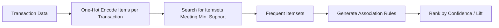

# 🔗 Frequent Pattern Mining in Python

> **Topic:** Unsupervised Learning — Frequent Pattern Mining | **Library:** mlxtend | **Language:** Python
> **Generated:** September 26, 2026

---

## 📑 Table of Contents

- [🔗 What Is Frequent Pattern Mining?](#-what-is-frequent-pattern-mining)
- [🧩 How Frequent Pattern Mining Works](#-how-frequent-pattern-mining-works)
- [🌳 Common Frequent Pattern Mining Algorithms](#-common-frequent-pattern-mining-algorithms)
  - [🔁 Apriori](#-apriori)
  - [🌲 FP-Growth](#-fp-growth)
  - [🕸️ Eclat](#️-eclat)
  - [⚡ FPGrowth at Scale with PySpark](#-fpgrowth-at-scale-with-pyspark)
- [🧭 Sequential Pattern Mining](#-sequential-pattern-mining)
  - [⏭️ PrefixSpan](#️-prefixspan)
- [📊 Association Rule Metrics](#-association-rule-metrics)
- [🧾 Quick Reference Summary](#-quick-reference-summary)

---

## 🔗 What Is Frequent Pattern Mining?

**Frequent pattern mining** is a data mining task that aims to discover **itemsets** — combinations of items — that occur frequently together in a dataset. These patterns uncover relationships among items and can be used for tasks such as **market basket analysis**, **recommendation systems**, and **fraud detection**.

> ⚠️ **Warning:** Apriori and FP-Growth are **not part of Scikit-Learn**. Scikit-Learn has no built-in frequent-itemset or association-rule mining module — these algorithms live in the **mlxtend** library (`mlxtend.frequent_patterns`), with PySpark's `pyspark.ml.fpm.FPGrowth` as the common choice at big-data scale.

Two core concepts underpin every algorithm in this space:

| Term | Meaning |
|---|---|
| **Itemset** | A set of one or more items that appear together in a transaction |
| **Support** | The proportion of transactions in the dataset that contain a given itemset |
| **Frequent itemset** | An itemset whose support meets or exceeds a chosen **minimum support threshold** |

> 💡 **Tip:** Once frequent itemsets are found, they're typically converted into **association rules** (e.g. "if a customer buys bread and butter, they're likely to also buy milk") and ranked by metrics such as **confidence** and **lift**.

---

## 🧩 How Frequent Pattern Mining Works

Both algorithms below solve the same problem — finding all itemsets that meet a minimum support threshold — but differ in how they search the space of possible itemsets.



> 📝 **Note:** The number of possible itemsets grows exponentially with the number of unique items, which is exactly the scaling problem Apriori and FP-Growth are each designed to manage — just with different strategies.

---

## 🌳 Common Frequent Pattern Mining Algorithms

### 🔁 Apriori

Generates frequent itemsets **iteratively**, growing candidate itemsets one item at a time and pruning away any candidate that doesn't meet the minimum support threshold at each step. It relies on the **Apriori property**: if an itemset is frequent, every subset of it must also be frequent — so any itemset with an infrequent subset can be discarded without further checking.

```python
from mlxtend.frequent_patterns import apriori, association_rules

frequent_itemsets = apriori(one_hot_df, min_support=0.01, use_colnames=True)
rules = association_rules(frequent_itemsets, metric="lift", min_threshold=1.0)
```

> ⚠️ **Warning:** Apriori's repeated candidate generation and full-dataset scans at each step make it computationally expensive on datasets with many unique items — FP-Growth is generally preferred at scale.

### 🌲 FP-Growth

Avoids Apriori's costly candidate generation by compressing the dataset into a compact tree structure called an **FP-tree** (frequent-pattern tree), then mining frequent itemsets directly from that tree without repeatedly rescanning the original transactions. This typically makes FP-Growth substantially faster than Apriori on large datasets.

```python
from mlxtend.frequent_patterns import fpgrowth, association_rules

frequent_itemsets = fpgrowth(one_hot_df, min_support=0.01, use_colnames=True)
rules = association_rules(frequent_itemsets, metric="lift", min_threshold=1.0)
```

> 💡 **Tip:** `apriori()` and `fpgrowth()` are drop-in replacements for each other in mlxtend — both return the same frequent-itemset DataFrame format, so switching between them requires no other code changes.

### 🕸️ Eclat

Short for **Equivalence Class Transformation** — takes a different approach from Apriori and FP-Growth by storing data in a **vertical format**: instead of listing the items in each transaction, it lists the transaction IDs in which each item appears. Frequent itemsets are then found by intersecting these ID lists, which avoids repeated dataset scans much like FP-Growth does, but via set intersection rather than a tree structure.

```python
from pyECLAT import ECLAT

eclat = ECLAT(data=transactions_df, verbose=True)
indexes, support = eclat.fit(min_support=0.01, min_combination=1, max_combination=3)
```

> 📝 **Note:** Eclat is not part of mlxtend — it requires the separate `pyECLAT` package. It tends to outperform Apriori on datasets with many transactions but relatively few unique items.

### ⚡ FPGrowth at Scale with PySpark

mlxtend's `fpgrowth()` runs in memory on a single machine, which becomes impractical for very large transaction datasets. PySpark's `pyspark.ml.fpm.FPGrowth` implements the same algorithm as a **distributed** Spark job, partitioning the work across a cluster.

```python
from pyspark.ml.fpm import FPGrowth

fp = FPGrowth(itemsCol="items", minSupport=0.01, minConfidence=0.5)
model = fp.fit(transactions_df)

model.freqItemsets.show()
model.associationRules.show()
```

> 💡 **Tip:** If you're already working with PySpark's MLlib for other tasks, `FPGrowth` fits into the same DataFrame-based pipeline API rather than requiring a separate mlxtend/pandas workflow.

---

## 🧭 Sequential Pattern Mining

Frequent pattern mining treats each transaction as an **unordered set** of items. When the *order* in which items or events occur matters — clickstreams, purchase sequences over time, log events — a related but distinct family of algorithms called **sequential pattern mining** is used instead.

### ⏭️ PrefixSpan

Finds frequent **subsequences** in a dataset of ordered sequences by recursively projecting the database into smaller subsets ("prefix projections") that share a common prefix, then growing each frequent prefix one step at a time. This avoids the candidate-generation overhead of earlier sequential-pattern algorithms (such as GSP), similar to how FP-Growth improves on Apriori for unordered itemsets.

```python
from pyspark.ml.fpm import PrefixSpan

prefix_span = PrefixSpan(minSupport=0.1, maxPatternLength=5, sequenceCol="sequence")
patterns = prefix_span.findFrequentSequentialPatterns(sequences_df)
patterns.show()
```

> 📝 **Note:** A standalone, non-Spark `prefixspan` package is also available on PyPI for smaller, single-machine sequence datasets.

---

## 📊 Association Rule Metrics

Once frequent itemsets are found, they're converted into **association rules** (`A → B`) and ranked by metrics that capture how meaningful each rule actually is — support alone isn't enough to judge whether a rule is useful.

| Metric | Meaning |
|---|---|
| **Support** | The proportion of transactions containing both A and B |
| **Confidence** | Of the transactions containing A, the proportion that also contain B |
| **Lift** | How much more likely B is, given A, compared to B's overall frequency — a lift of 1 means A and B are independent |
| **Leverage** | The difference between the observed frequency of A and B together and the frequency expected if they were independent |
| **Conviction** | How strongly the rule implies B in the *absence* of independence — higher values indicate a stronger dependency |

> 💡 **Tip:** Lift above 1 indicates a positive association worth acting on; lift at or below 1 means the rule isn't more informative than random chance. See the Market Basket Analysis course notes for a worked walkthrough of these metrics.

---

## 🧾 Quick Reference Summary

| Algorithm | Code |
|---|---|
| Apriori | `from mlxtend.frequent_patterns import apriori` |
| FP-Growth | `from mlxtend.frequent_patterns import fpgrowth` |
| Association Rules (either algorithm) | `from mlxtend.frequent_patterns import association_rules` |
| Eclat | `from pyECLAT import ECLAT` |
| FPGrowth (PySpark, distributed) | `from pyspark.ml.fpm import FPGrowth` |
| PrefixSpan (PySpark, sequential patterns) | `from pyspark.ml.fpm import PrefixSpan` |
