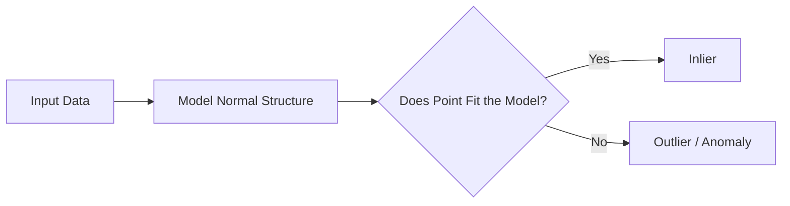

# 🚨 Outlier Detection with Scikit-Learn

> **Topic:** Anomaly Detection | **Library:** Scikit-Learn | **Language:** Python
> **Generated:** September 26, 2026

---

## 📑 Table of Contents

- [🚨 What Is Outlier Detection?](#-what-is-outlier-detection)
- [🧩 How Outlier Detection Works](#-how-outlier-detection-works)
- [🌳 Common Outlier Detection Methods](#-common-outlier-detection-methods)
  - [🌲 Isolation Forest](#-isolation-forest)
  - [📍 Local Outlier Factor (LOF)](#-local-outlier-factor-lof)
  - [➗ One-Class SVM](#-one-class-svm)
  - [🔍 DBSCAN](#-dbscan)
  - [📏 IQR (Interquartile Range)](#-iqr-interquartile-range)
  - [🥚 Elliptic Envelope](#-elliptic-envelope)
  - [📊 Z-Score Method](#-z-score-method)
  - [🧮 Minimum Covariance Determinant (MCD)](#-minimum-covariance-determinant-mcd)
  - [🧰 PyOD Library](#-pyod-library)
- [🧾 Quick Reference Summary](#-quick-reference-summary)

---

## 🚨 What Is Outlier Detection?

**Outlier detection** — also called **anomaly detection** — identifies observations in a dataset that deviate significantly from the majority of the data. These unusual observations are called **outliers** or **anomalies**.

> 💡 **Tip:** Outlier detection is widely used in finance (fraud detection), healthcare (identifying abnormal test results), cybersecurity (detecting intrusions), and manufacturing (flagging defective units) — anywhere unusual patterns matter more than the typical case.

Outlier detection methods generally fall into two categories:

| Category | Description | Example Methods |
|---|---|---|
| **Novelty detection** | Training data is assumed to be free of outliers; the model learns "normal" and flags new data that doesn't fit | One-Class SVM |
| **Outlier detection** | Training data itself may contain outliers, which the model identifies as part of fitting | Isolation Forest, LOF, DBSCAN |

---

## 🧩 How Outlier Detection Works

Different methods define "unusual" differently — by isolation, density, distance, or a learned boundary — but most share a common pattern: model what "normal" looks like, then score or flag points that don't fit.



> ⚠️ **Warning:** Most of these methods are sensitive to **feature scale** — standardize or normalize features first, or features with larger numeric ranges will dominate distance- and density-based calculations.

---

## 🌳 Common Outlier Detection Methods

### 🌲 Isolation Forest

Isolates observations by **randomly selecting a feature**, then randomly selecting a split value between that feature's minimum and maximum. This process is repeated recursively, building a tree — outliers, being few and different, tend to be **isolated in fewer splits** than typical points, so a short average path length across many trees signals an anomaly.

```python
from sklearn.ensemble import IsolationForest

model = IsolationForest(contamination=0.05, random_state=42)
predictions = model.fit_predict(X)  # 1 = inlier, -1 = outlier
```

> 💡 **Tip:** Isolation Forest scales well to high-dimensional and large datasets since it doesn't rely on distance or density calculations — a key advantage over LOF or DBSCAN.

### 📍 Local Outlier Factor (LOF)

Calculates the **local density** of each data point and compares it to the local densities of its neighbors. A point whose density is substantially lower than its neighbors' is flagged as an outlier — this makes LOF a **local** method, able to detect outliers that are only anomalous relative to their immediate neighborhood, even in datasets with clusters of varying density.

```python
from sklearn.neighbors import LocalOutlierFactor

model = LocalOutlierFactor(n_neighbors=20, contamination=0.05)
predictions = model.fit_predict(X)  # 1 = inlier, -1 = outlier
```

> ⚠️ **Warning:** By default, `LocalOutlierFactor` only supports outlier detection on the training set via `fit_predict()`. To score genuinely new data (novelty detection), set `novelty=True` and use `predict()` on unseen points instead.

### ➗ One-Class SVM

Learns a **boundary** — using the same kernel-based approach as a standard SVM — that separates the majority of the data from the origin in a transformed feature space, effectively enclosing the "normal" region. Points falling outside that boundary are classified as outliers.

```python
from sklearn.svm import OneClassSVM

model = OneClassSVM(nu=0.05, kernel="rbf", gamma="scale")
predictions = model.fit_predict(X)  # 1 = inlier, -1 = outlier
```

> 📝 **Note:** One-Class SVM is a **novelty detection** method — it's designed to be trained on clean, outlier-free data and then used to flag anomalies in new, unseen data, rather than to detect outliers within its own training set.

### 🔍 DBSCAN

A **density-based clustering algorithm** (see [Clustering with Scikit-Learn](#)) that doubles as an outlier detector. DBSCAN groups together points that are closely packed based on two parameters — a distance threshold (`eps`) and a minimum number of neighboring points (`min_samples`, sometimes called `MinPts`). Points that don't belong to any sufficiently dense group are left unassigned and treated as outliers.

```python
from sklearn.cluster import DBSCAN

model = DBSCAN(eps=0.5, min_samples=5)
labels = model.fit_predict(X)  # -1 indicates an outlier
```

> 💡 **Tip:** DBSCAN doesn't require specifying how many outliers to expect (unlike `contamination` in Isolation Forest or LOF) — it discovers them naturally as points that fail to join any cluster.

### 📏 IQR (Interquartile Range)

A **statistical**, non-machine-learning method for detecting outliers in a single feature at a time. The **IQR** is the difference between the third quartile (Q3) and first quartile (Q1) of a dataset — a robust measure of the spread of the middle 50% of the data. Any point falling below `Q1 − 1.5 × IQR` or above `Q3 + 1.5 × IQR` is flagged as an outlier.

```python
import numpy as np

Q1, Q3 = np.percentile(X, [25, 75])
IQR = Q3 - Q1
lower_bound = Q1 - 1.5 * IQR
upper_bound = Q3 + 1.5 * IQR

outliers = (X < lower_bound) | (X > upper_bound)
```

> 📝 **Note:** Unlike the other methods here, IQR isn't part of Scikit-Learn — it's a simple statistical rule typically computed directly with NumPy or pandas. It's most useful as a quick, interpretable first pass on individual features rather than a substitute for multivariate methods.

### 🥚 Elliptic Envelope

Assumes the "normal" data is drawn from a single **Gaussian distribution**, fits a robust estimate of that distribution's mean and covariance, then draws an ellipse (envelope) around the bulk of the data. Points falling outside the envelope — measured by their **Mahalanobis distance** from the center — are flagged as outliers.

```python
from sklearn.covariance import EllipticEnvelope

model = EllipticEnvelope(contamination=0.05, random_state=42)
predictions = model.fit_predict(X)  # 1 = inlier, -1 = outlier
```

> ⚠️ **Warning:** Elliptic Envelope assumes the inlier data is **unimodal and roughly Gaussian** — it performs poorly on multimodal data or data with multiple distinct clusters, where Isolation Forest or LOF are better suited.

### 📊 Z-Score Method

Like IQR, a simple statistical rule rather than a Scikit-Learn model. The **Z-score** measures how many standard deviations a point lies from the feature's mean; points beyond a chosen threshold (commonly ±3) are flagged as outliers.

```python
import numpy as np

z_scores = (X - np.mean(X)) / np.std(X)
outliers = np.abs(z_scores) > 3
```

> ⚠️ **Warning:** The Z-score method assumes the feature is roughly **normally distributed** and is itself sensitive to extreme outliers skewing the mean and standard deviation used to compute it — IQR is generally more robust for skewed data.

### 🧮 Minimum Covariance Determinant (MCD)

The **robust covariance estimator** that powers Elliptic Envelope under the hood, and can also be used directly. Rather than computing covariance from the full dataset (which outliers can distort), MCD finds the subset of points whose covariance matrix has the smallest determinant, producing a covariance estimate that isn't skewed by the very outliers you're trying to detect.

```python
from sklearn.covariance import MinCovDet

mcd = MinCovDet(random_state=42).fit(X)
mahalanobis_distances = mcd.mahalanobis(X)
```

> 📝 **Note:** Use `MinCovDet` directly when you want the robust distance scores themselves (e.g. for custom thresholding or visualization) rather than a ready-made inlier/outlier label — `EllipticEnvelope` wraps this same estimator with that labeling built in.

### 🧰 PyOD Library

Not part of Scikit-Learn, but the standard Python toolkit built specifically for anomaly detection. **PyOD** wraps 40+ algorithms — including Isolation Forest, LOF, and One-Class SVM above — behind a single consistent API, and adds detectors not available in Scikit-Learn at all, including deep-learning-based methods like **autoencoders** and **ensemble/combination** approaches.

```python
from pyod.models.iforest import IForest

model = IForest(contamination=0.05, random_state=42)
model.fit(X)
predictions = model.labels_  # 0 = inlier, 1 = outlier
```

> 💡 **Tip:** PyOD is worth reaching for when you want to benchmark several detectors quickly (its API is consistent across all of them) or need a method — like autoencoder-based detection — that Scikit-Learn doesn't offer at all.

---

## 🧾 Quick Reference Summary

| Method | Code |
|---|---|
| Isolation Forest | `from sklearn.ensemble import IsolationForest` |
| Local Outlier Factor | `from sklearn.neighbors import LocalOutlierFactor` |
| One-Class SVM | `from sklearn.svm import OneClassSVM` |
| DBSCAN | `from sklearn.cluster import DBSCAN` |
| IQR | `Q1, Q3 = np.percentile(X, [25, 75])` |
| Elliptic Envelope | `from sklearn.covariance import EllipticEnvelope` |
| Z-Score | `z_scores = (X - np.mean(X)) / np.std(X)` |
| Minimum Covariance Determinant | `from sklearn.covariance import MinCovDet` |
| PyOD (Isolation Forest example) | `from pyod.models.iforest import IForest` |
